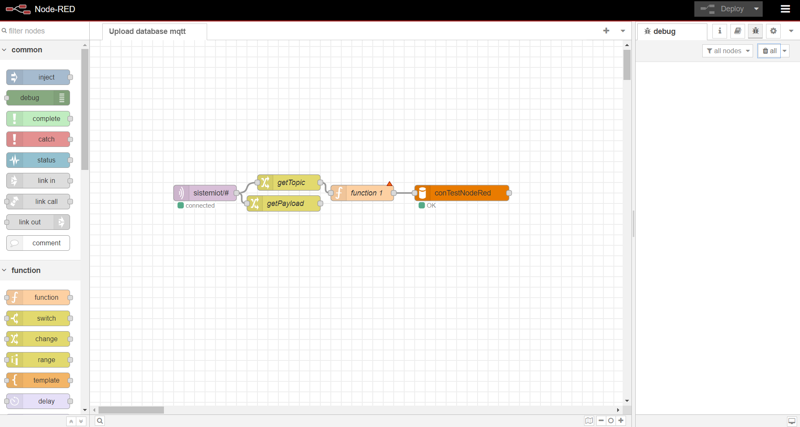

# IoT System with MQTT and PHP Mysql

## Description
This porject using ESP32 as uC to get data from any sensor and send the data to MQTT broker (mosquitto). <br>
MQTT Broker transmit the data to MySql Server via Node-Red and store that data as data history <br>
The Server also hosting web server (Apache2) to monitoring and controling the IoT System

## Instalation
### Server Broker Mosquitto
1. Install mosquitto on your linux server
2. Open mosquitto.conf
3. Uncoment listener 1883
4. Add this code
   ``` 
   listener 9001
   protocol websockets
   ```
5. Uncoment allow_anonymous and set to false
6. Edit password_file to your path password file
7. Save mosquitto.conf
8. Run this command on mosquitto directory
   ```
   vi passwd
   .\mosquitto_passwd.exe -c .\passwd
   ```
9. Restart mosquitto
   ```
   systemctl mosquitto restart
   ```

### Web server and MySql Database
1. Install apache2 as web server and mysql-server as database
    ```
    apt install apache2
    apt install mysql-server
    ```
2. Upload database file **sistemiot** to your database
3. Place website code to your root directory **var/www/html**

### Node-RED
1. Download and install node.js
2. Install and run Node-RED
    ```
    npm install -g --unsafe-perm node-red
    node-red
    ```
3. Access node-red editor on your browser http://localhost:1880
4. Setting node-red to connect mqtt to mysql database


## Hardware Device
* Computer Server
* ESP32 Dev kit board 
* Potensiometer
* Sensor DHT22
* LED Notification
* Relay Optocoupler
* Servo Motor

## Wiring Diagram
| ESP32     | DHT22    | Potentiometer    | Servo Motor    | LED Notif    | Relay    |
| --------|---------|---------|---------|---------|---------|
| 5V  | +   | Left   | +   |    | +   |
| GND  | - | Right | - | - | - |
|26|||5V|||
|32||Mid||||
|13|||S|||
|12||||+||
|33|||||Out|


## Flow System


## Monitoring and Controlling Web Server

## Data Historic

****************************************************
Created July 2024 By Andi Saputra IG : @andi21262